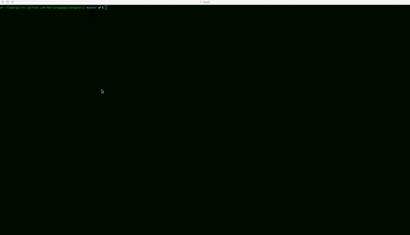

# ponganoid
A simple cli game reminiscent of Pong and Arkanoid.



## Installation instructions (requires Go)

```
$ go get github.com/marianogappa/ponganoid
$ cd $GOPATH/src/github.com/marianogappa/ponganoid
$ make
$ ./ponganoid
```

## Game instructions

- Use arrow keys to change the white `o`'s direction
- Game ends if you reach max health (i.e. you win) or min health (i.e. you lose)
- Collecting a heart gives you a +1 health
- A collision with an enemy gives you a -1 health
